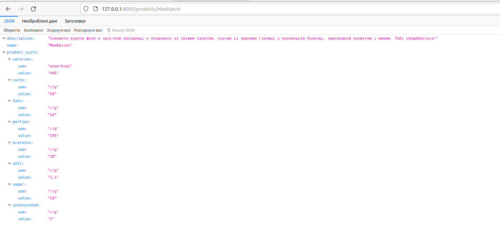
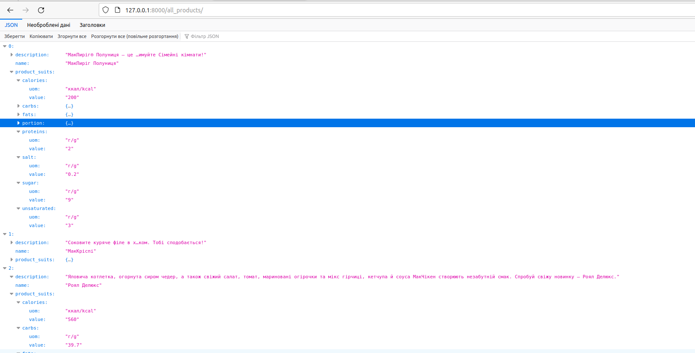

### Project macdonalds-fullmenu

### Projectfor parsing macdonalds menu Api, save it to json destination file and run with flask application.


### How to install Project
clone project from repo:
```bash
git clone git@github.com:yevhenii-nevmyvako/mac_menu.git
```
install virtual environment and setup the project:
```bash
python -m venv venv
```
run the venv
```bash
Windows: venv\Scripts\activate
Unix/Linux: source venv/bin/activate
```
Setup the project:
```bash
pip install -e .
```

### How to run project
run script to parse the mac-menu and save data to json destination file
```bash
parse_menu path/to/dst_filepath.json
```
input filepath to app.py to src_filepath and run cmd:
```bash
run-flask-app
```

### Endpoints example
```
http://127.0.0.1:8000/all_products/
http://127.0.0.1:8000/products/МакКріспі
http://127.0.0.1:8000/products/МакКріспі/fats
```
### demo



also tou can use in docker
```bash
docker build -t tag .
docker run -p 8000:8000 <image_name:tag>
```


